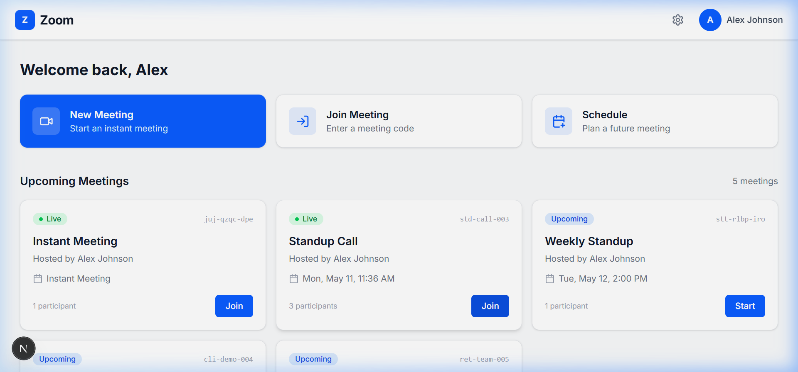

# 🎥 Zoom Clone — Video Conferencing Platform

A full-stack Zoom-inspired video conferencing application with meeting scheduling, instant meetings, participant management, and a clean modern UI.

**Live Demo (Frontend):** [https://frontend-ivory-zeta-93.vercel.app](https://frontend-ivory-zeta-93.vercel.app)  
**Live API (Backend):** [https://zoom-clone-w5sv.onrender.com/docs](https://zoom-clone-w5sv.onrender.com/docs)



---

## 🛠 Tech Stack

| Layer      | Technology              | Version  |
| ---------- | ----------------------- | -------- |
| Frontend   | Next.js (React)         | 16.2.6   |
| Styling    | Tailwind CSS            | 4.x      |
| Language   | TypeScript              | 5.x      |
| Backend    | FastAPI (Python)        | 0.115+   |
| ORM        | SQLAlchemy (async)      | 2.x      |
| Database   | SQLite + aiosqlite      | 3.x      |
| Server     | Uvicorn                 | 0.34+    |

---

## 📋 Prerequisites

- **Node.js** 18+ and **npm** 9+
- **Python** 3.11+
- **pip** (Python package manager)
- **Git**

---

## 🚀 Setup

### Backend

```bash
# 1. Clone the repository
git clone https://github.com/your-username/zoom-clone.git
cd zoom-clone

# 2. Navigate to backend
cd backend

# 3. Create and activate a virtual environment
python -m venv venv

# On macOS/Linux:
source venv/bin/activate

# On Windows:
venv\Scripts\activate

# 4. Install dependencies
pip install -r requirements.txt

# 5. Seed the database with sample data
python seed_db.py

# 6. Start the backend server
uvicorn main:app --reload --port 8000
```

The API will be available at **http://localhost:8000**  
Interactive docs at **http://localhost:8000/docs**

### Frontend

```bash
# 1. Open a new terminal and navigate to frontend
cd frontend

# 2. Install dependencies
npm install

# 3. (Optional) Copy and configure environment variables
cp .env.example .env.local

# 4. Start the development server
npm run dev
```

The app will be available at **http://localhost:3000**

---

## 🔧 Environment Variables

### Frontend (`frontend/.env.local`)

| Variable              | Default                  | Description                     |
| --------------------- | ------------------------ | ------------------------------- |
| `NEXT_PUBLIC_API_URL`  | `http://localhost:8000`  | URL of the FastAPI backend      |

### Backend (`backend/.env`)

| Variable              | Default                                  | Description                     |
| --------------------- | ---------------------------------------- | ------------------------------- |
| `DATABASE_URL`         | `sqlite+aiosqlite:///./zoom_clone.db`    | Database connection string      |
| `DEFAULT_USER_NAME`   | `Alex Johnson`                           | Demo user display name          |
| `DEFAULT_USER_EMAIL`  | `alex@demo.com`                          | Demo user email                 |

---

## 📁 Folder Structure

```
zoom-clone/
├── README.md
├── backend/
│   ├── .env.example
│   ├── config.py              # App configuration (DB URL, default user)
│   ├── database.py            # SQLAlchemy async engine + session factory
│   ├── main.py                # FastAPI app entry point + CORS + router registration
│   ├── models.py              # SQLAlchemy ORM models (5 tables)
│   ├── schemas.py             # Pydantic request/response schemas
│   ├── requirements.txt       # Python dependencies
│   ├── seed_db.py             # Database seeder with sample data
│   ├── test_api.py            # API test script
│   ├── SCHEMA_RATIONALE.md    # Database design decisions
│   ├── routers/
│   │   ├── health.py          # GET /api/health
│   │   ├── meetings.py        # /api/meetings/* (CRUD + code lookup + join)
│   │   └── participants.py    # /api/meetings/{id}/participants/*
│   └── services/
│       ├── meeting_service.py     # Meeting business logic
│       └── participant_service.py # Participant business logic
├── frontend/
│   ├── .env.example
│   ├── package.json
│   ├── tsconfig.json
│   ├── next.config.ts
│   ├── postcss.config.mjs
│   └── src/
│       ├── lib/
│       │   └── api.ts             # Typed fetch wrapper (apiFetch)
│       ├── types/
│       │   └── meeting.ts         # TypeScript interfaces
│       ├── components/
│       │   ├── Navbar.tsx         # Sticky top navigation bar
│       │   ├── MeetingCard.tsx    # Upcoming meeting card
│       │   ├── RecentMeetingRow.tsx # Recent meeting list row
│       │   ├── NewMeetingModal.tsx  # Instant meeting creation modal
│       │   └── ScheduleModal.tsx   # Schedule meeting form modal
│       └── app/
│           ├── globals.css        # Global styles + Tailwind
│           ├── layout.tsx         # Root layout (Inter font, metadata)
│           ├── page.tsx           # Dashboard (home page)
│           ├── join/
│           │   └── page.tsx       # Join meeting by code (2-step flow)
│           └── room/
│               └── [code]/
│                   └── page.tsx   # Meeting room (video placeholder)
```

---

## 🗄 Database Schema

| Table                    | Key Fields                                                  |
| ------------------------ | ----------------------------------------------------------- |
| `users`                  | id, name, email, created_at                                 |
| `meetings`               | id, title, meeting_code, host_id, status, scheduled_at, participant_count |
| `meeting_participants`   | id, user_id, meeting_id, role, joined_at, left_at           |
| `chat_messages`          | id, meeting_id, sender_id, content, sent_at                 |
| `recordings`             | id, meeting_id, file_name, file_path, duration_seconds      |

---

## 📌 API Endpoints

| Method | Endpoint                                | Description                    |
| ------ | --------------------------------------- | ------------------------------ |
| GET    | `/api/health`                           | Health check                   |
| POST   | `/api/meetings`                         | Create a meeting               |
| GET    | `/api/meetings`                         | List meetings (with filters)   |
| GET    | `/api/meetings/{id}`                    | Get meeting by ID              |
| PATCH  | `/api/meetings/{id}`                    | Update a meeting               |
| DELETE | `/api/meetings/{id}`                    | Delete a meeting               |
| GET    | `/api/meetings/code/{code}`             | Get meeting by join code       |
| POST   | `/api/meetings/code/{code}/join`        | Join meeting by code           |
| POST   | `/api/meetings/{id}/participants`       | Add participant                |
| GET    | `/api/meetings/{id}/participants`       | List participants              |
| DELETE | `/api/meetings/{id}/participants/{uid}` | Remove participant             |

---

## ⚠️ Assumptions Made

- **No authentication**: A single demo user ("Alex Johnson") is hardcoded. No login/signup.
- **No real video**: The meeting room shows a placeholder. Video SDK integration is marked with `// VIDEO INTEGRATION POINT`.
- **SQLite only**: Uses a local SQLite file for simplicity. Not suitable for concurrent production use.
- **No WebSockets**: Chat messages and participant updates require page refresh.
- **Single user**: All actions are performed as the default user (id=1).

---

## 🚧 Known Limitations

1. **No real-time updates** — Dashboard doesn't auto-refresh when new meetings are created by others.
2. **No video/audio** — Meeting room is a placeholder; requires Daily.co or similar SDK integration.
3. **No multi-user support** — Cannot create accounts or switch users.
4. **SQLite file locking** — SQLite doesn't handle concurrent writes well; use PostgreSQL for production.
5. **No meeting end flow** — There's no button to end/complete a meeting from the UI.
6. **Description field** — Collected in the schedule form but not stored (backend schema doesn't have it).

---

## 🚀 Deployment

### Frontend → Vercel

1. Push your code to GitHub
2. Go to [vercel.com](https://vercel.com) → **New Project**
3. Import your GitHub repository
4. Set the **Root Directory** to `frontend`
5. Set environment variable: `NEXT_PUBLIC_API_URL` = your backend URL (e.g., `https://your-api.onrender.com`)
6. Click **Deploy**

### Backend → Render

1. Go to [render.com](https://render.com) → **New Web Service**
2. Connect your GitHub repository
3. Set the **Root Directory** to `backend`
4. **Build Command**: `pip install -r requirements.txt`
5. **Start Command**: `uvicorn main:app --host 0.0.0.0 --port $PORT`
6. Set environment variable: `DATABASE_URL` = your production database URL
7. Click **Create Web Service**

> **Note**: For production, switch from SQLite to PostgreSQL. Update `DATABASE_URL` to a PostgreSQL connection string and install `asyncpg` instead of `aiosqlite`.

---

## 📄 License

MIT
